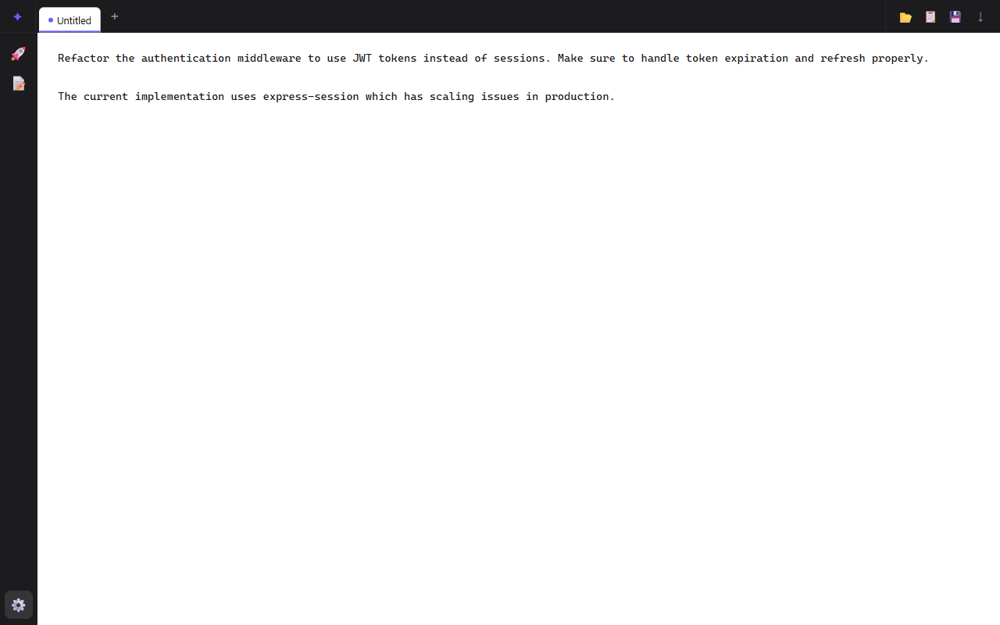
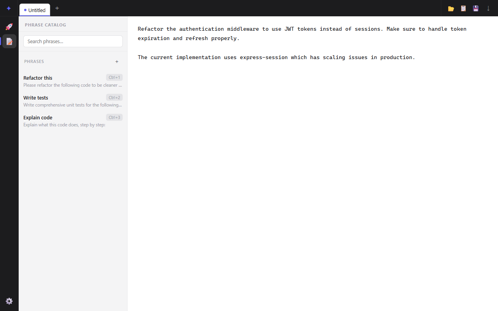
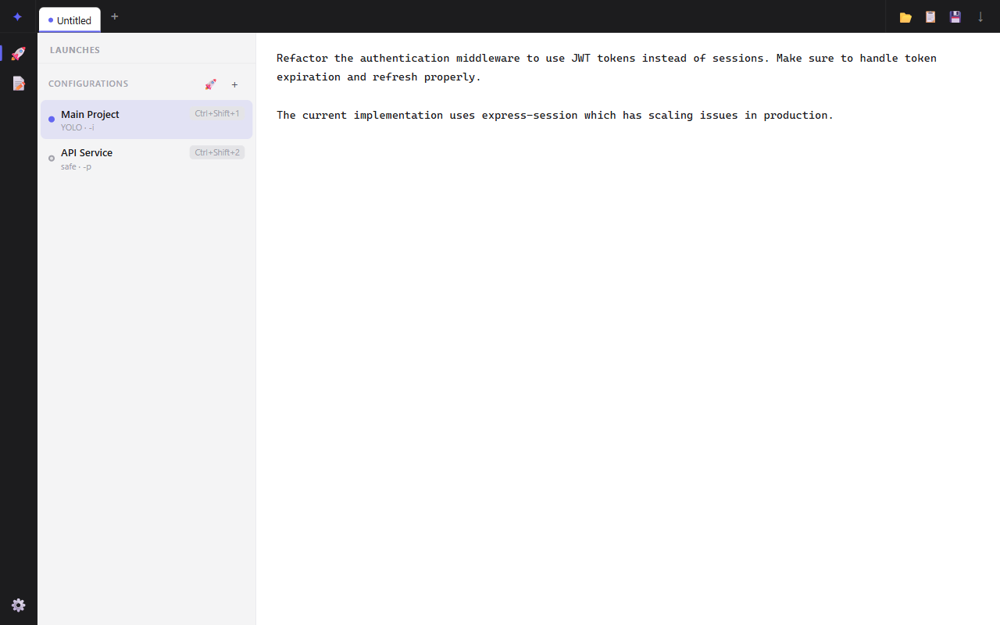
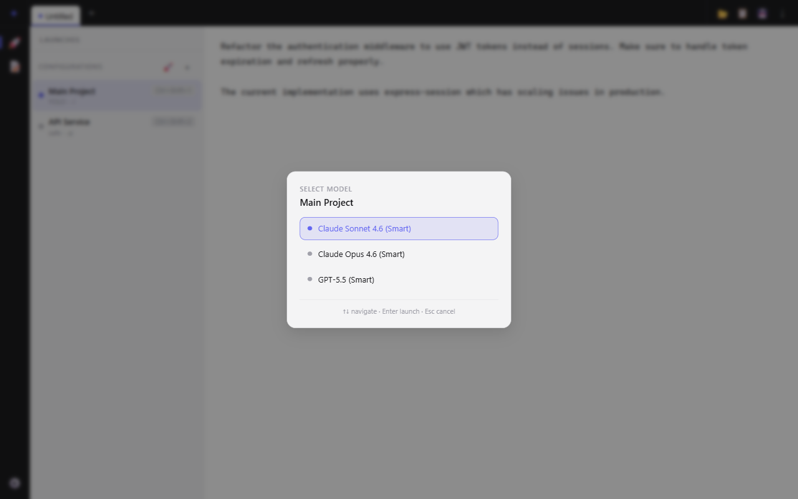
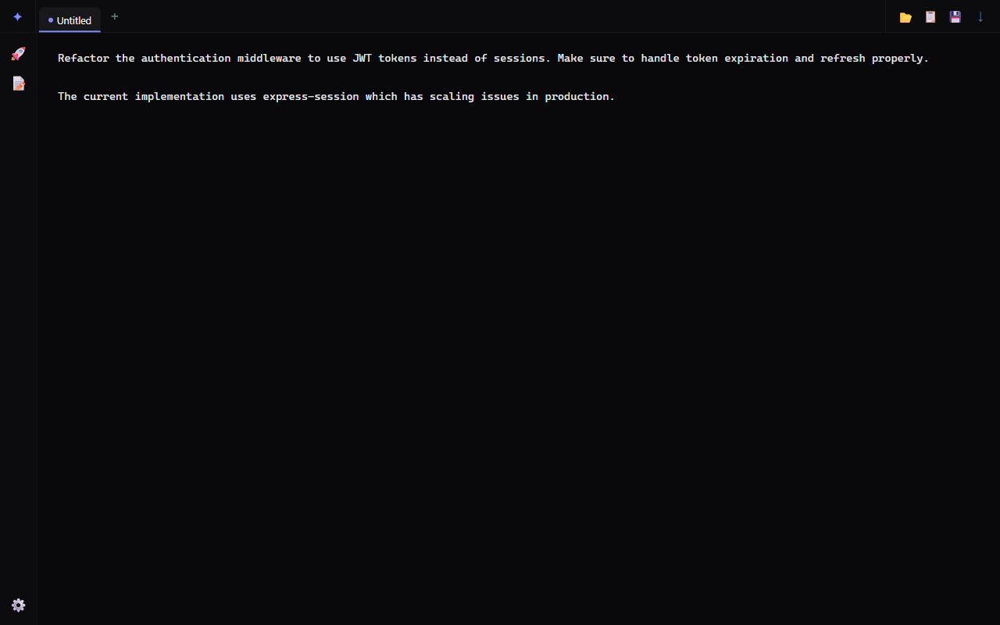
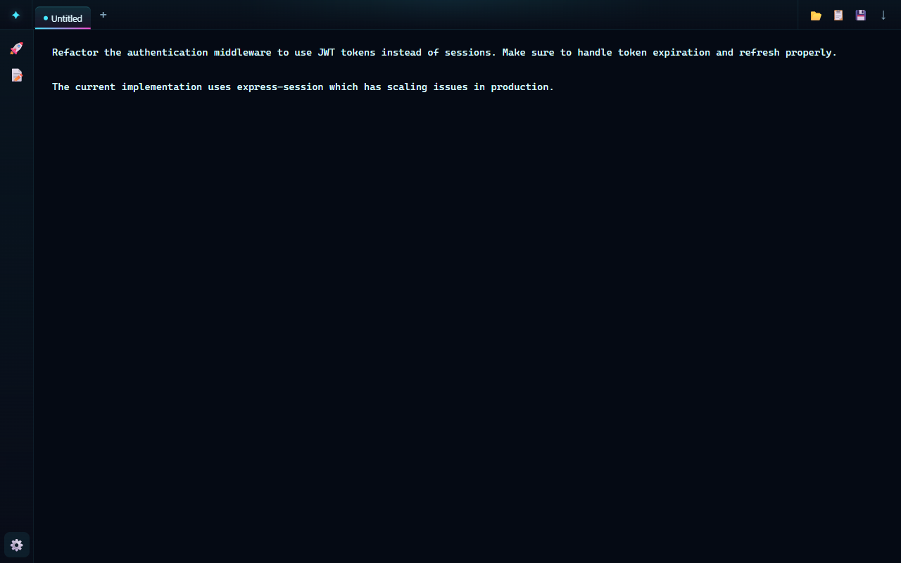
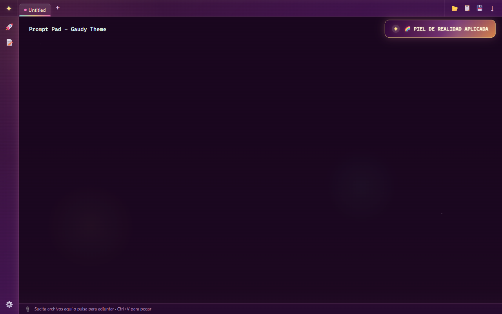

# Prompt Pad

A native desktop app (Electron + React) for writing, organising, and firing AI prompts at the **GitHub Copilot CLI** or **OpenCode** — without leaving your keyboard.

---

## How to Use It (The Prompt Pad Way)

### The Philosophy: One Launcher Per Folder + CLI

Prompt Pad was built for people who don't want to juggle terminal tabs, `cd` into the right directory, remember which flags to pass, and then forget which model they were using. Instead:

1. **Write your prompt** in the editor.
2. **Press `Ctrl+Shift+1`** (or whatever number your launcher is).
3. **Pick a model** from the picker.
4. **Done** — a terminal window opens and runs the CLI with your prompt.

That's it. No terminals to manage. No context switching. Just write, fire, and go back to what you were doing.

### The Multi-Folder Trick: Run Multiple CLIs in Parallel

Here's the secret sauce: **duplicate your project folder**.

```
my-project/
my-project_1/
my-project_2/
my-project_3/
```

Yes, really. Git worktrees exist, but let's be honest — half of us still look up the syntax every time. Copying a folder is free, works everywhere, and your brain already understands it.

Create one launcher per folder copy, each pointing to a different `_N` directory. Now you can:

| Launcher | Task | What happens |
|---|---|---|
| `#1` → `my-project/` | "Refactor the auth module" | CLI works on the main copy |
| `#2` → `my-project_1/` | "Write tests for the API" | Tests run in parallel, no conflicts |
| `#3` → `my-project_2/` | "Create a PR for the feature" | PR gets created while you keep working |
| `#4` → `my-project_3/` | "Review the PR and suggest fixes" | Code review happens independently |

**The workflow:**
1. Write your prompt: *"Create a PR for the new feature branch"*
2. Hit `Ctrl+Shift+3` → model picker → Enter
3. Go back to writing prompts for launcher #1 and #2
4. Come back later — the PR is ready. Review it. Done.

You're essentially running a tiny AI dev team, each working in their own sandbox. No merge conflicts until you want them. No waiting for one task to finish before starting the next. Just write, fire, repeat.

### The Phrase Catalog: Type Once, Reuse Forever

Here's where you really save time. The **Phrase Catalog** lets you store text templates and insert them into your prompt with a single keyboard shortcut (`Ctrl+1` through `Ctrl+0`).

The idea: **build your prompt from reusable blocks** instead of typing the same thing over and over.

#### A Typical Phrase Catalog

| # | Shortcut | Phrase | What it does |
|---|---|---|---|
| 1 | `Ctrl+1` | *"You are an expert Python developer with 15 years of experience. Write clean, PEP-8 compliant code with type hints and docstrings."* | Sets the AI's persona — the foundation of every prompt |
| 2 | `Ctrl+2` | *"Use pytest for testing. Include edge cases and parametrized tests."* | Your standard testing instructions |
| 3 | `Ctrl+3` | *"Add type hints to all functions and classes. Use `typing` module imports."* | Type annotation reminder |
| 4 | `Ctrl+4` | *"Follow the repository's existing code style. Match the patterns in the surrounding files."* | Style consistency guard |
| 5 | `Ctrl+5` | *"Write a README section explaining the new feature with usage examples."* | Documentation template |
| ... | ... | *(your own phrases)* | *(add whatever you repeat the most)* |
| 10 | `Ctrl+0` | *"Review all tests, update documentation, create a feature branch, and open a pull request with a descriptive title and body."* | The grand finale — the "do everything and ship it" phrase |

#### The Full Workflow

1. **Open a new tab** (`Ctrl+T`) for your next task.
2. **Hit `Ctrl+1`** — *"You are an expert Python developer..."* — your prompt now has a persona.
3. **Type your specific task** — *"Refactor the database module to use async/await"*.
4. **Hit `Ctrl+2`** — testing instructions appended.
5. **Hit `Ctrl+5`** — documentation request appended.
6. **Hit `Ctrl+0`** — the closer: review, branch, PR.
7. **Hit `Ctrl+Shift+3`** — fire it at your launcher.
8. **Go make coffee.** By the time you're back, the PR is waiting for your review.

Your prompt went from *"Refactor the database module"* (5 words) to a comprehensive, multi-paragraph instruction with persona, testing standards, documentation, and delivery — all in **6 keystrokes**.

#### Why This Saves Hours

| Without Phrases | With Phrases |
|---|---|
| Type 200+ words of boilerplate every time | Type the task, insert phrases with `Ctrl+N` |
| Forget to mention testing standards | Always included, never forgotten |
| Inconsistent persona descriptions | Same expert persona, every time |
| Spend 5 minutes crafting each prompt | Spend 5 seconds |

The phrases you set up once pay dividends forever. It's like having a macro keyboard for your AI prompts — but the macros are smart, editable, and reorderable with drag-and-drop.

### Launch History — Your Prompt Time Machine

Here's the thing about firing prompts at AI: sometimes you write something brilliant, hit launch, and then immediately forget what you wrote. Or worse — you write something *truly* brilliant, the CLI does its thing, and three weeks later you need that exact prompt again but your brain has moved on to other things.

Enter the **Launch History** panel. Every time you fire a prompt, Prompt Pad remembers it. All of it. The prompt text, the model you used, whether you went YOLO or played it safe, the tool, the mode — the whole forensic record.

#### What You Get

| Feature | What it does |
|---|---|
| **Grouped by launcher** | History entries are organized under their launch config name. Expand a group to see all the prompts you've fired through that launcher. |
| **Search everything** | Search across prompt text, model name, tool, and launcher name. Type "refactor" and find every time you asked the AI to refactor something. |
| **Double-click to restore** | Found that brilliant prompt from last Tuesday? Double-click it and it opens in a new tab, ready to fire again. |
| **Auto-collapse** | Groups start collapsed so you're not overwhelmed. Search auto-expands matching groups. Clear the search and they collapse again. |
| **Deleted launcher handling** | If you delete a launcher, its history entries stick around (you might still need those prompts!) but show the original launcher name. |

#### The "I Remember Writing Something Good" Workflow

1. **Hit the History button** (📋) in the activity bar.
2. **Scan your recent launches** — grouped by launcher, sorted by time.
3. **See "3 hr ago" under "Refactor Auth"** — ah yes, that prompt you wrote at 2 PM.
4. **Double-click it** — boom, new tab with the exact prompt text.
5. **Tweak and fire again** — or just fire it as-is. No retyping. No "what did I write last time?"

#### Why This Exists

| Without History | With History |
|---|---|
| "What was that prompt I used last week?" | Search, find, double-click, done |
| Rewrite the same prompt from memory | Exact text, every time |
| Scroll through terminal output to find it | Clean panel, organized by launcher |
| Hope your clipboard still has it | It's in history. It's always in history. |

Your launch history is basically a prompt journal you didn't have to write. Every fire-and-forget prompt is catalogued, searchable, and one double-click away from resurrection.

### Why This Beats Terminal Tabs

| Terminal Tabs | Prompt Pad |
|---|---|
| Open 4 terminals, `cd` 4 times | One window, one editor |
| Remember which flags each CLI needs | Launchers store everything |
| Lose track of which model you picked | Model picker every time, fresh choice |
| Scroll back through walls of output | Each CLI gets its own terminal window |
| Accidentally run command in wrong dir | Each launcher locks to its folder |

---

## Screenshots

### Editor — write your prompt in a distraction-free multi-tab editor



### Phrase Catalog — save and reuse text snippets with `Ctrl+1…9`



### Launch Configurations — manage pre-configured Copilot CLI / OpenCode runs



### Launch History — every prompt you've ever fired, grouped and searchable

*(Screenshot coming soon — your history is too personal to screenshot anyway)*

### Model Picker — choose the model at launch time (↑↓ + Enter)



### Themes

| Light | Dark | Cyberpunk |
|---|---|---|
|  |  |  |

### Gaudy Theme — The Extra One

The Gaudy theme is best experienced live. It features:
- **Burst particles** on every keystroke — colours explode from your cursor
- **Converging particles** when you delete text — particles rush back to the deletion point
- **Floating background particles** — ambient ambient ambient
- **Scanline overlay** — CRT monitor vibes
- **Typing glow effect** — your text pulses with energy
- **Pulsing fire button** — the launch button breathes with intensity
- **Themed toast notifications** — even your toasts are extra



*Screenshot doesn't do it justice — you need to see the particles in motion!*

---

## Features

### Editor
- **Multi-tab**: unlimited tabs; `Ctrl+T` to create, middle-click or `×` to close.
- **Auto-session**: tab state (title, content, path) is saved every 600 ms and restored on the next launch.
- **Plain-text contenteditable core**: editor now uses a `contenteditable` surface with strict plain-text sync, so launches always send plain text/markdown (no rich-text styles or HTML).
- **Save/Open**: `Ctrl+S` (save), `Ctrl+Shift+S` (save as), `Ctrl+O` (open).
- **Copy prompt**: copies the entire active tab's content to the clipboard.
- **File attachments**: drag & drop files onto the editor or paste clipboard images (Snipping Tool, PrintScreen). Attached files are sent alongside your prompt when launching.
- **Gaudy theme animations**: colour burst particles on every keystroke, converging particles on deletion, floating background particles, scanline overlay, and pulsing fire button.

### Phrase Catalog
- **Reusable snippets**: create named text templates you type once and reuse everywhere.
- **Keyboard insertion**: `Ctrl/⌘+1` through `Ctrl/⌘+9` (and `+0`) insert phrase at the current cursor position.
- **Catalog insertion highlight**: when a phrase is inserted from the catalog, only the inserted fragment is temporarily highlighted with theme-aware colors in the editor.
- **Drag-to-reorder**: grab the ⠿ handle and drop a phrase to a new position. The `Ctrl+N` shortcuts adjust automatically and the new order is auto-saved.
- **Search**: filter phrases by name or content with the search bar.

### Launch Configurations
- **Pre-configured runs**: each config stores a name, working folder, `--yolo` flag, tool (Copilot CLI or OpenCode), and interactive / non-interactive mode.
- **Model chosen at launch time**: when you fire a config (🚀 button or `Ctrl+Shift+1–9`), a **model picker** appears — navigate with `↑ ↓`, confirm with `Enter`, cancel with `Esc`.
- **Drag-to-reorder**: drag the ⠿ handle to reprioritise configs. The `Ctrl+Shift+N` shortcuts follow the list order and are auto-saved.
- **Keyboard shortcuts**: `Ctrl/⌘+Shift+1` through `+9` (and `+0`) fire the corresponding launch config on the current tab's content.
- **Open folder in VS Code**: each launch shortcut can also open the launch folder in VS Code using a configurable modifier in Settings (`Ctrl+Shift`, `Ctrl+Alt`, or `Ctrl+Alt+Shift`).
- **Pin favourite models**: pin models in the picker for quick access with number keys.

### Launch History
- **Every launch remembered**: prompt text, model, tool, YOLO flag, and mode — all saved automatically.
- **Grouped by launcher**: entries organized under their launch config name with collapsible groups.
- **Full-text search**: filter by prompt content, model name, tool, or launcher name.
- **Double-click to restore**: opens the exact prompt in a new tab, ready to edit or re-fire.
- **Auto-sync aware**: history syncs via OneDrive when enabled, so your prompt journal follows you across machines.
- **Gaudy theme toasts**: even clearing history gets a dramatic notification.

### Model Picker
- **Dynamic model lists**: fetches available models from both Copilot CLI (`copilot help config`) and OpenCode (`opencode models`) at runtime.
- **Dual tool support**: automatically shows the correct model list based on whether the launch config uses Copilot or OpenCode.
- **Official tool branding**: launch rows and picker badges use official tool icons (including OpenCode square mark) with theme-aware contrast.
- **Always starts at the top**: the model list stays at the top when loading — scroll down manually to browse all models.
- **Cost indicators**: each model shows a `free` badge or signal bars (1-5) based on pricing — hover for exact pricing per 1M tokens (input, output, cached) and usage limits.
- **Expensive model confirmation**: launching tier 4-5 models prompts a confirmation dialog to prevent accidental high-cost launches.
- **Pin favourite models**: press `Ctrl+1` through `Ctrl+0` while hovering a model to pin it to the top. Pinned models appear first and can be launched instantly with `1` through `0`. Press the same shortcut again to unpin.
- **Drag-to-reorder pinned**: drag the ⠿ handle on pinned models to reorder them.
- **CLI sync**: pinned models are saved to `settings.json` and sync via OneDrive when enabled. The model list is always fresh from the CLI — pins just give you quick access to your favourites.

### Settings
- **Language**: auto-detect (from system locale), English, or Spanish.
- **OneDrive sync**: `phrases.json` and `launches.json` can be synced via OneDrive. First-enable migrates existing files automatically.
- **Auto-updates**: automatically checks for new versions on startup and every 4 hours. Downloads and installs updates silently — just restart when prompted. Manual check button also available.

### Auto-Updates
Prompt Pad automatically keeps itself up to date:
- Checks for updates on every launch
- Periodic background checks every 4 hours
- Downloads updates silently in the background
- Prompts to restart when a new version is ready
- Manual "Check for updates" button in Settings
- No need to manually download installers — updates are applied automatically

---

## Keyboard shortcuts

| Shortcut | Action |
|---|---|
| `Ctrl/⌘ + 1–9, 0` | Insert phrase #1–10 at cursor |
| `Ctrl/⌘ + Shift + 1–9, 0` | Open model picker for launch config #1–10 |
| `Ctrl/⌘ + S` | Save current tab |
| `Ctrl/⌘ + Shift + S` | Save current tab as… |
| `Ctrl/⌘ + O` | Open file into current tab |
| `Ctrl/⌘ + T` | New tab |
| `Ctrl + 1–0` (in model picker) | Pin/unpin model |
| `1–0` (in model picker) | Launch pinned model |

---

## Development

```bash
npm install
npm run dev          # Vite dev server + Electron hot-reload
```

## Build & package

```bash
npm run build        # TypeScript compile + Vite bundle (no packaging)

npm run dist:win     # Windows NSIS installer  (x64)
npm run dist         # All platforms (Windows + macOS)
```

### macOS installer
The macOS build produces a `.dmg` installer for both Intel (`x64`) and Apple Silicon (`arm64`) Macs. Download the appropriate `.dmg` from GitHub Releases, open it, and drag Prompt Pad to your Applications folder.

---

## Data storage

All local data lives in `~/.prompt-pad/`:

| File | Contents |
|---|---|
| `settings.json` | Theme, language, OneDrive preference |
| `phrases.json` | Phrase catalog *(moved to OneDrive when sync is on)* |
| `launches.json` | Launch configurations *(moved to OneDrive when sync is on)* |
| `launch-history.json` | Launch history *(moved to OneDrive when sync is on)* |
| `session.json` | Open tabs state (autosaved; ephemeral) |
| `prompts/` | Explicitly saved prompt files |

### OneDrive paths (when sync is enabled)

| OS | Path |
|---|---|
| Windows | `%OneDrive%\Apps\PromptPad\` |
| macOS | `~/Library/CloudStorage/OneDrive-Personal/Apps/PromptPad/` |

When you enable OneDrive sync for the first time, existing local `phrases.json`, `launches.json`, and `launch-history.json` are **migrated automatically**.

---

## Tech stack

| Layer | Library / Tool | Version |
|---|---|---|
| Native shell | Electron | 39 |
| UI | React | 18 |
| Language | TypeScript | 5 |
| State | Zustand | 5 |
| Bundler | Vite (vite-plugin-electron) | 6 |
| Packaging | electron-builder | 26 |
| Auto-updates | electron-updater | 6 |
| Package manager | npm | – |
